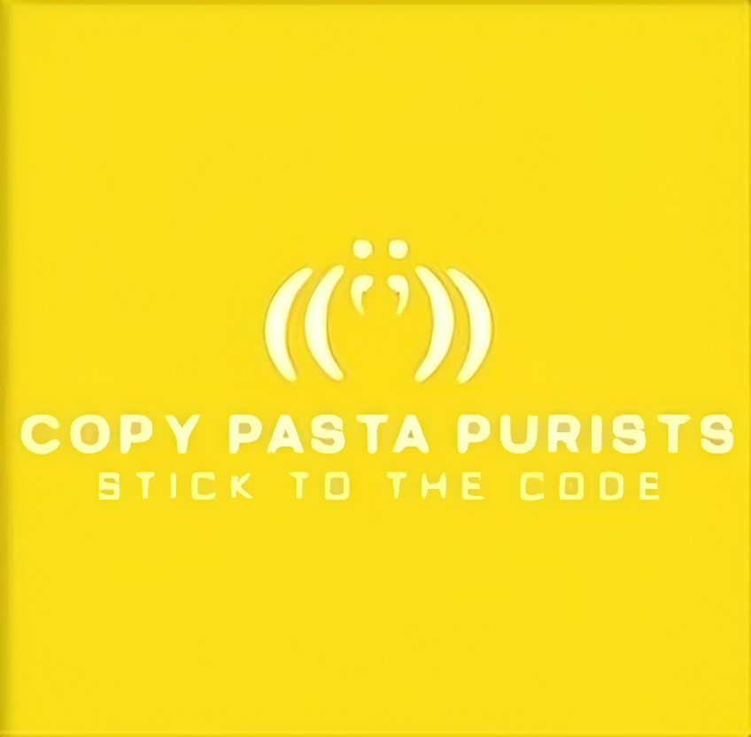

# GoodGameOrg

## Below is a short description:

### What was your motivation?
We were motivated to build a complete league and tournament tracker.  Giving players, coaches, or fans a way to instantly create save and share tournaments.

### Why did you build this project?
It is a useful tool for designing, saving, and sharing mutable league data centric to tournament functions.

### What problem does it solve?
Leagues can access specific design tools necessary for creating new tournaments based around user inputed data.

### What did you learn?

Render, MongoDB, Express, React, Node.js

## Table of Contents

- [Installation](#installation)
- [Usage](#usage)
- [License](#license)
- [Contributing](#contributing)
- [Tests](#tests)
- [Email](#email)

## Installation

- Render Deployment Link:

## Usage

https://github.com/CarlosLavayenJr/GoodGameOrg

<video src="./Assets/Sequence_2.MP4" controls></video>

## License

      
MIT License

Permission is hereby granted, free of charge, to any person obtaining a copy
of this software and associated documentation files (the "Software"), to deal
in the Software without restriction, including without limitation the rights
to use, copy, modify, merge, publish, distribute, sublicense, and/or sell
copies of the Software, and to permit persons to whom the Software is
furnished to do so, subject to the following conditions:

The above copyright notice and this permission notice shall be included in all
copies or substantial portions of the Software.

THE SOFTWARE IS PROVIDED "AS IS", WITHOUT WARRANTY OF ANY KIND, EXPRESS OR
IMPLIED, INCLUDING BUT NOT LIMITED TO THE WARRANTIES OF MERCHANTABILITY,
FITNESS FOR A PARTICULAR PURPOSE AND NONINFRINGEMENT. IN NO EVENT SHALL THE
AUTHORS OR COPYRIGHT HOLDERS BE LIABLE FOR ANY CLAIM, DAMAGES OR OTHER
LIABILITY, WHETHER IN AN ACTION OF CONTRACT, TORT OR OTHERWISE, ARISING FROM,
OUT OF OR IN CONNECTION WITH THE SOFTWARE OR THE USE OR OTHER DEALINGS IN THE
SOFTWARE.

## Contributing
Email one of the team for more information about how to contribute to the project, or how to help fund it in the future.

## Tests
Deployed on Render - npm run develop

## Questions
- [clavayen98@hotmail.com](mailto:clavayen98@hotmail.com) 
- [ellagirin82@gmail.com](mailto:ellagirin82@gmail.com) 
- [hunterde91@gmail.com](mailto:hunterde91@gmail.com) 
- [micahreadmgmt@gmail.com](mailto:micahreadmgmt@gmail.com) 
- [alex.rybak333@gmail.com](mailto:alex.rybak333@gmail.com)

---

### Created by
Carlos Lavayen, Ella Girin, Hunter Leclair, Micah Read, Alex Rybak

 

# Sources

<pre>
 .d8888b.                                  8888888b.                   888                  8888888b.                   d8b          888             
d88P  Y88b                                 888   Y88b                  888                  888   Y88b                  Y8P          888             
888    888                                 888    888                  888                  888    888                               888             
888         .d88b.  88888b.  888  888      888   d88P 8888b.  .d8888b  888888  8888b.       888   d88P 888  888 888d888 888 .d8888b  888888 .d8888b  
888        d88""88b 888 "88b 888  888      8888888P"     "88b 88K      888        "88b      8888888P"  888  888 888P"   888 88K      888    88K      
888    888 888  888 888  888 888  888      888       .d888888 "Y8888b. 888    .d888888      888        888  888 888     888 "Y8888b. 888    "Y8888b. 
Y88b  d88P Y88..88P 888 d88P Y88b 888      888       888  888      X88 Y88b.  888  888      888        Y88b 888 888     888      X88 Y88b.       X88 
 "Y8888P"   "Y88P"  88888P"   "Y88888      888       "Y888888  88888P'  "Y888 "Y888888      888         "Y88888 888     888  88888P'  "Y888  88888P' 
                    888           888                                                                                                                
                    888      Y8b d88P                                                                                                                
                    888       "Y88P"                                                                                                                 
</pre>